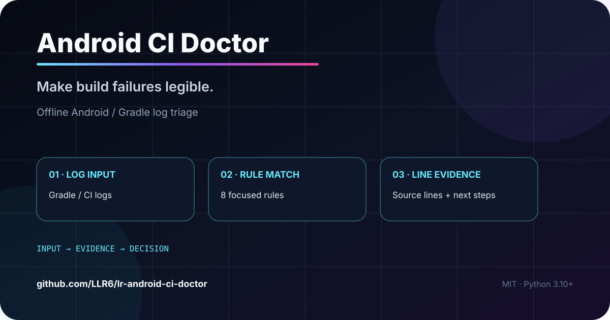
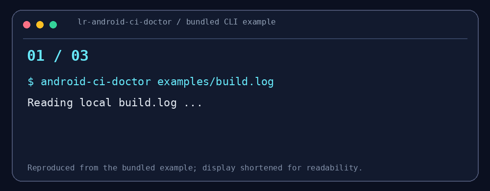

# Android CI Doctor

### 几千行构建日志，从哪一行开始查？

把 Android / Gradle / CI 日志整理成带源行号、上下文和排查建议的报告。适合 APK 构建、签名配置和产物上传失败时快速缩小排查范围。

[快速体验](#30-秒试玩) · [实跑案例](docs/DEMO.md) · [完整输出](examples/showcase/output.json) · [反馈问题](https://github.com/LLR6/lr-android-ci-doctor/issues)

| 你的场景 | 可以先试什么 |
| --- | --- |
| 签名失败后又报 APK 不存在 | 先看首次命中的签名证据，再核查产物路径 |
| 想把日志分析接入流水线 | JSON 输出；命中时可返回退出码 2 |
| 需要给同事说明排查依据 | 附原行号和已去敏的上下文 |

<p align="center"></p>

<p align="center"></p>
<p align="center"><sub>示例来自仓库自带的 build.log；画面为便于阅读的节选。</sub></p>

<p align="center"><strong>构建失败时，先找到哪一行、为什么、下一步查什么。</strong></p>
<p align="center">本地分析 Android / Gradle / GitHub Actions 日志；保留证据行号，不上传日志。</p>
<p align="center"><a href="#30-秒看懂">30 秒看懂</a> · <a href="#5-分钟开始">5 分钟开始</a> · <a href="#能力与边界">能力与边界</a></p>
<p align="center">   </p>

## 30 秒看懂

当 CI 只给你几千行日志时，直接搜索 `Keystore file not found` 或 `No files were found with the provided path` 往往还要手工猜根因。这个工具把常见信号整理成 **规则 ID → 原日志行号 → 去敏证据 → 检查建议**。

```text
本地日志 → 规则扫描 → 带行号的证据 → Markdown / JSON
```

## 30 秒试玩

在仓库根目录运行，无需模型 API：

```bash
python -m pip install -e .
android-ci-doctor examples/build.log
```

示例输出节选（来自 `examples/build.log`）：

```text
SIGN-01 · 签名配置缺失
L3: Keystore file '/home/runner/work/app/release.jks' not found

APK-01 · 产物路径不匹配
L4: No files were found with the provided path: app/build/outputs/apk/release/*.apk
```

## 三个值得看的点

- **证据回溯**：规则命中保留原行号，让你能回到完整日志核对上下文。
- **本地与去敏**：离线运行，输出遮盖常见 Token 与口令；公开前仍需人工检查。
- **接入 CI**：`--format json` 方便脚本处理；`--fail-on-findings` 命中时退出码为 2。

## 5 分钟开始

要求 Python 3.10+。

```bash
git clone https://github.com/LLR6/lr-android-ci-doctor.git
cd lr-android-ci-doctor
python -m pip install -e .
android-ci-doctor examples/build.log
android-ci-doctor examples/build.log --format json --fail-on-findings
cat examples/build.log | android-ci-doctor -
```

最后一条是 Linux / macOS 的管道示例；Windows 可直接传入文件路径。`--fail-on-findings` 的退出码 2 表示命中线索，并不代表程序崩溃。

## 能力与边界

识别 JDK、SDK、依赖、签名、缓存、测试与 APK 路径等常见失败信号。**规则匹配不是自动修复，也不能替代对最早失败信息的检查**。根因与连带错误可能同时命中；不要把每条命中都当作独立故障。脱敏不是安全边界；不会执行日志里的命令，也不会访问网络。


## 实跑结果与使用案例

本次运行命中 **2 条规则**：`SIGN-01` 首次出现在 L3，`APK-01` 出现在 L4。报告先列签名线索，保留相邻上下文；这表示排查顺序，不是自动确认根因。

[查看运行过程与读结果的方法](docs/DEMO.md) · [查看未经改写的 JSON 输出](examples/showcase/output.json)

## 参与 / Help Wanted

欢迎提交**已经去敏**的失败片段，并标注预期规则和误报反例。下一步可做 Gradle 版本矩阵核验、因果链排序与 SARIF 输出。验证代码：`python -m unittest discover -s tests`。

作者：LLR6 · MIT License

<!-- LR-CONTENT-UPGRADE:START -->
## v0.2：不只告诉你“命中了什么”，还告诉你先看哪里

Finding 现在包含：

- `first_line`：第一次出现证据的位置；
- `occurrences`：同类信号出现次数；
- `priority`：排查优先度；
- `evidence`：脱敏后的命中内容。

还可以带上下文：

```bash
android-ci-doctor examples/build.log --context 2
```

工具按**首次出现位置优先**排序 finding。这样一个上游构建/签名错误后面引发的 “APK artifact not found”，不会因为最终报错更醒目就被误当成第一排查点。

上下文同样经过 token/password 脱敏。设计说明见 [docs/TRIAGE_MODEL.md](docs/TRIAGE_MODEL.md)。

<!-- LR-CONTENT-UPGRADE:END -->

<!-- LR-DEEP-CONTENT:START -->
### Labeled log benchmark

`benchmarks/examples.json` 给合成构建日志标注了预期 finding：

- signing + missing artifact；
- JDK mismatch；
- dependency resolution；
- unit-test failure。

CI 会对每份日志重新运行分析器，并要求实际 Rule ID 与期望集合一致。

这能防止一个很常见的问题：为了支持新错误模式不断加正则，结果旧规则开始误命中或漏命中。
<!-- LR-DEEP-CONTENT:END -->


<!-- LR-RELATED:START -->
### Related LR Lab projects
- [LR-Tablet](https://github.com/LLR6/LR-Tablet) — Android tablet project with reproducible CI builds.
- [CTF Tracebook](https://github.com/LLR6/lr-ctf-tracebook) — another small evidence-first local CLI tool.
- [LR-Agent](https://github.com/LLR6/LR-agent) — broader automation and reliability experiments.
<!-- LR-RELATED:END -->

<details>
<summary>工程文档与兼容性</summary>

[Architecture](./docs/ARCHITECTURE.md) · [Benchmarks](./docs/BENCHMARKS.md) · [Triage model](./docs/TRIAGE_MODEL.md) · [Roadmap](./docs/ROADMAP.md) · [Compatibility](./docs/COMPATIBILITY.md) · [Releasing](./docs/RELEASING.md) · [Security](./SECURITY.md) · [Support](./SUPPORT.md)
 · [Change risk](./docs/CHANGE_RISK.md) · [Failure modes](./docs/FAILURE_MODES.md)

[贡献说明](CONTRIBUTING.md) · [版本记录](CHANGELOG.md) · [输出格式](schemas)

</details>
